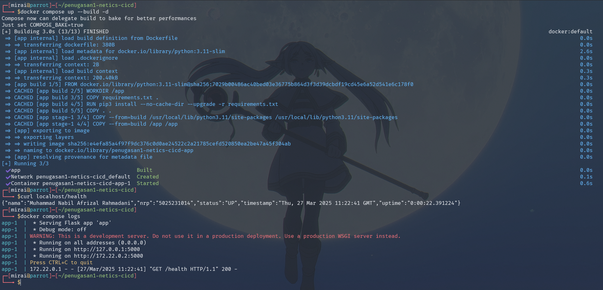
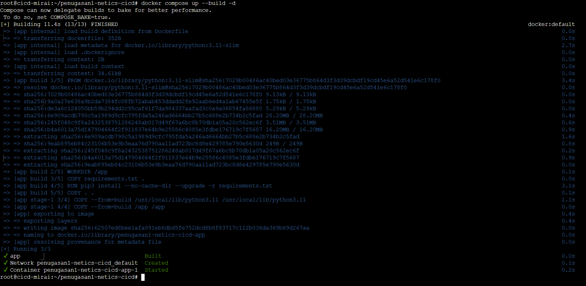
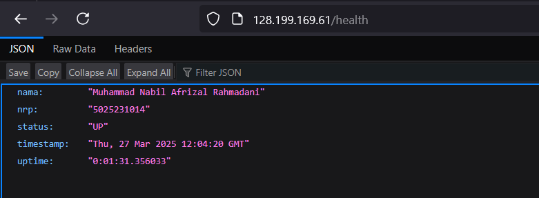
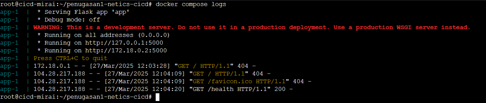
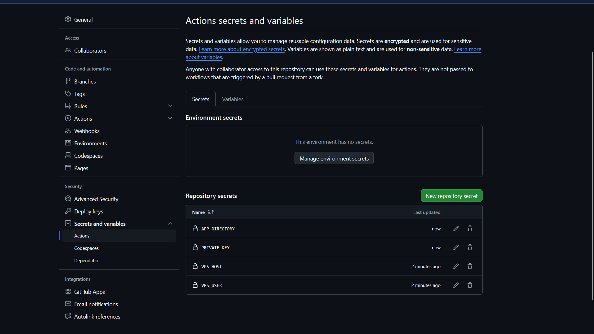
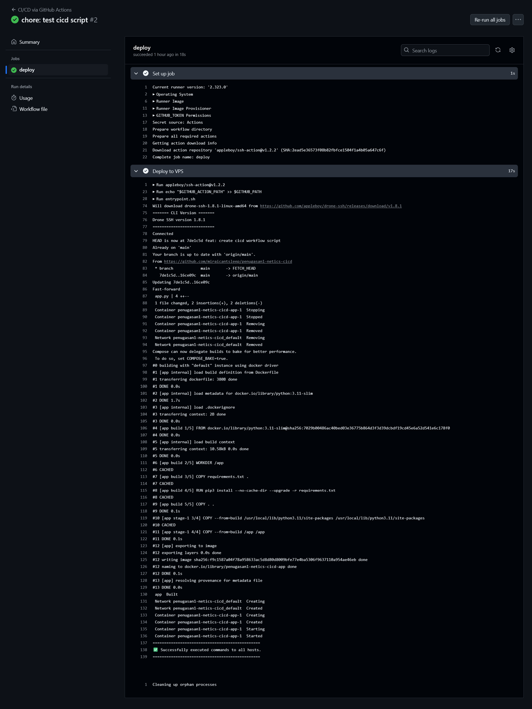

# penugasan1-netics-cicd

|               Nama               |    NRP     |
| :------------------------------: | :--------: |
| Muhammad Nabil Afrizal Rahmadani | 5025231014 |

> [!TIP]
> API dapat diakses pada http://128.199.169.61/health

## Soal 1
Buatlah API publik dengan endpoint /health yang menampilkan informasi sebagai berikut:

Bahasa pemrograman dan teknologi yang digunakan dibebaskan kepada peserta.

```
{
  "nama": "Tunas Bimatara Chrisnanta Budiman",
  "nrp": "5025231999",
  "status": "UP",
  “timestamp”: time	    // Current time
  "uptime": time		// Server uptime
}
```

### Jawaban
Disini saya menggunakan python dengan framework Flask dikarenakan mudah untuk dibuat dan di deploy.

```py
from flask import Flask
from datetime import datetime, timedelta

app = Flask(__name__)
start = datetime.now()

@app.route('/health')
def health():
    return {'nama': 'Muhammad Nabil Afrizal Rahmadani',
            'nrp': '5025231014',
            'status': 'UP',
            'timestamp': datetime.now(),
            'uptime': str(datetime.now() - start)
            }

if __name__ == '__main__':
    app.run(host='0.0.0.0', port=5000)
```

## Soal 2
Lakukan deployment API tersebut dalam bentuk container (Docker Multi-stage) pada VPS publik.

### Jawaban
Untuk menjalankan aplikasi ini, kita perlu membuat Dockerfile terlebih dahulu.

```Dockerfile
FROM python:3.11-slim AS build

WORKDIR /app
COPY requirements.txt .
RUN pip3 install --no-cache-dir --upgrade -r requirements.txt
COPY . .

FROM python:3.11-slim

WORKDIR /app
COPY --from=build /usr/local/lib/python3.11/site-packages /usr/local/lib/python3.11/site-packages
COPY --from=build /app /app

EXPOSE 5000
CMD ["python3", "app.py"]
```

Saya melakukan multi-stage deployment agar size image yang dihasilkan lebih kecil.

Lalu saya menggunakan docker compose dengan konfigurasi sebagai berikut:

```yml
services:
  app:
    build: .
    ports:
      - "80:5000"
    restart: always
```

Lalu jalankan dengan command `docker-compose up --build -d`, berikut adalah screenshot dari aplikasi yang sudah di deploy di lokal:



#### Deployment ke VPS

Untuk deployment ke VPS, pertama-tama kita perlu menginstall docker dan docker-compose di VPS tersebut. Kita dapat mengikuti tutorial di dokumentasi [Docker](https://docs.docker.com/engine/install/ubuntu/).

Lalu kita clone repository yang sudah kita buat sebelumnya, dan jalankan perintah `docker-compose up --build -d`. Setelah itu, kita dapat mengakses aplikasi tersebut melalui IP VPS pada port 80 dan pada endpoint /health.



Lalu setelah melakukan deployment, kita akses di browser menggunakan url `http://<ip_vps>/health` dan hasilnya adalah sebagai berikut:



Setelah diakses, kita dapat melihat log sebagai berikut:



## Soal 3
Lakukan proses CI/CD menggunakan GitHub Actions untuk melakukan otomasi proses deployment API. Terapkan juga best practices untuk menjaga kualitas environment CI/CD.

### Jawaban
Untuk melakukan CI/CD menggunakan GitHub Actions, saya membuat file `.github/workflows/deploy.yml` dengan konfigurasi sebagai berikut:

```yml
name: CI/CD via GitHub Actions

on:
  push:
    branches: [ "main" ]

jobs:

  deploy:
    runs-on: ubuntu-latest
    steps:
    - name: Deploy to VPS
      uses: appleboy/ssh-action@v1.2.2
      with: 
        host: ${{ secrets.VPS_HOST }}
        username: ${{ secrets.VPS_USER }}
        key: ${{ secrets.PRIVATE_KEY }}
        script: |
              echo "Connected"
              cd ${{ secrets.APP_DIRECTORY }}
              git status
              git reset --hard HEAD
              git clean -fd
              git checkout main
              git pull origin main
              docker compose down -v
              docker compose up --build -d
```

Disini saya menggunakan `appleboy/ssh-action` untuk melakukan deployment ke VPS. Untuk menjaga _confidentiality_, saya menyimpan `VPS_HOST`, `VPS_USER`, `APP_DIRECTORY` dan `PRIVATE_KEY` di secrets repository.



Saya melakukan `git reset`, `git clean`, dan `git checkout` untuk memastikan bahwa folder pada VPS sama dengan repository yang ada di GitHub. Lalu saya melakukan `docker compose down -v` untuk menghapus container yang sudah ada dan `docker compose up --build -d` untuk menjalankan container yang baru.

Berikut log dari GitHub Actions yang sudah dijalankan:



Atau dapat dilihat pada [Action Workflow](https://github.com/miraicantsleep/penugasan1-netics-cicd/actions/runs/14119305586/job/39556462944)